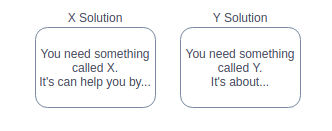
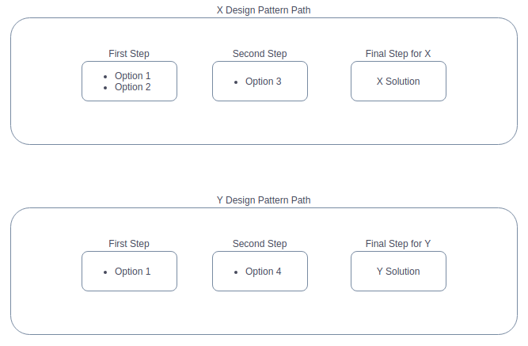
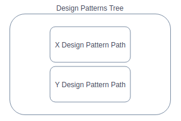
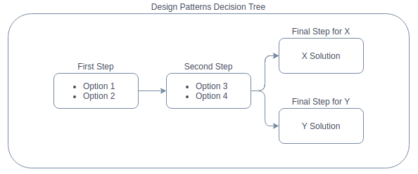

Working with models.
========================================

The models are designed to be as easy as possible to create and use trees and paths.
Each path has its own steps and options to solve some specific problem.

The first thing to consider is what problem you want the path to solve.
To do this, you need to define a potential solution. The abstract design patterns named X and Y will be a good example.

Then you can start designing the path itself.
Break it down into steps that will contain options leading to the next steps. On the last step of the given path you should have a solution.

The last thing is to connect the paths within a tree.
It's very important to stay consistent while naming steps and options. This will allow the tree to work properly.

This way, the steps will connect with each other and depending on the options someone choose, it will be able to find the right solution.

This is obviously a very simple example, where tree branches off on the final step, but it should give an idea of how the system works.
More complex trees will have more paths and therefore more branches and more options.
